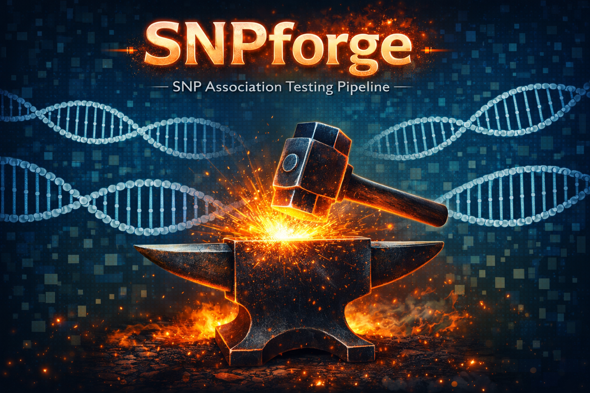

# SNPforge

<p align="center">
  
</p>

## Overview

SNPforge is a configurable R pipeline for SNP-based association testing. It is designed to help you:

1. Read a table of variants of interest.
2. Extract genotypes for those variants from chromosome-level `.bcf`, `.vcf`, or `.vcf.gz` files with `bcftools`.
3. Join genotype dosages to phenotype metadata.
4. Optionally join a separate table of genetic principal components.
5. Fit regression models across many SNP/outcome combinations, either as main effects only or with an optional SNP interaction term.
6. Save assembled analysis tables, model outputs, and run logs in a reproducible output directory.

The main pipeline script is:

- [`scripts/run_snpforge.R`](scripts/run_snpforge.R)

Example configs are included at:

- [`config/example_main_effects_config.yaml`](config/example_main_effects_config.yaml)
- [`config/example_interaction_config.yaml`](config/example_interaction_config.yaml)

Example mapping file is included at:

- [`mapping_file/example_id_mapping.csv`](mapping_file/example_id_mapping.csv)

## What the pipeline produces

Given a config file, SNPforge:

- reads a variant file and constructs per-variant genomic queries
- extracts matching records from chromosome-specific genotype files using `bcftools view`
- parses extracted VCFs into per-subject genotype dosage tables
- harmonizes IDs across genotype, phenotype, and optional PC tables
- builds a unified analysis tibble
- fits either main-effect models or SNP-by-interaction models across all requested outcomes
- writes analysis outputs, diagnostics, and logs under `output_dir`

Typical outputs include:

- `tables/genotypes.tsv.gz`
- `tables/analysis_table.tsv.gz`
- `models/all_model_terms.tsv.gz`
- `models/interaction_results.tsv.gz`
- `logs/genotype_extraction_summary.tsv`
- `logs/model_diagnostics.tsv`
- `logs/id_overlap_summary.tsv`
- `logs/pipeline.log`

## Model structure

SNPforge supports either:

```r
outcome ~ SNP + covariates
```

or:

```r
outcome ~ SNP * interaction_term + covariates
```

If `interaction_col` is omitted, the pipeline fits main-effect models only. If `interaction_col` is supplied, that column must already exist in the assembled analysis data.

Key model output files:

- `all_model_terms.tsv.gz`: all coefficients from all successfully fit models
- `interaction_results.tsv.gz`: only true SNP-by-interaction terms when an interaction is configured

These model-result tables include coefficient interpretation columns such as:

- `estimate`
- `conf.low`
- `conf.high`
- `direction`
- `effect_scale`
- `reference_level`
- `odds_ratio`
- `or_conf.low`
- `or_conf.high`
- `n_complete`

`logs/model_diagnostics.tsv` records model-screening and fit information for every outcome/SNP combination, including:

- `status`
- `reason`
- `n_complete`
- `fit_status`
- `fit_error`

This is the first place to look when models are skipped because of missing columns, no complete finite cases, degenerate factors, or fit failures.

## Requirements

SNPforge expects:

- `bcftools` to be available on the command line
- the following R packages to be installed:
  - `broom`
  - `fs`
  - `glue`
  - `purrr`
  - `tibble`
  - `tidyr`
  - `tidyverse`
  - `vroom`
  - `yaml`
  - `vcfR`
  - `MASS`
- `future` and `furrr` for parallel execution if you want parallel model runs

If `furrr` is not installed, the pipeline falls back to sequential `purrr::pmap()`.

## Config file

The pipeline expects a YAML config file using the simplified SNPforge format.

### Required arguments

- `variant_file`
  Path to the table listing variants to extract and test.

- `variant_file_format`
  File format for the variant file. Supported values are `tsv`, `csv`, or `delim`.

- `variant_col`
  Column in `variant_file` containing variant IDs in `chr:pos:ref:alt` format.

- `subjects_file`
  Path to the sample list passed to `bcftools` with `-S`.

- `genotype_file_template`
  Template for chromosome-specific genotype files. Use `{chromosome}` where the chromosome token should be substituted.

- `pheno_file`
  Path to the phenotype/metadata table.

- `pheno_format`
  File format for the phenotype file: `tsv`, `csv`, or `delim`.

- `pheno_id_col`
  Column in the phenotype table containing the subject ID for that file.

- `genotype_id_type`
  Whether genotype IDs are in `raw_id` space or already in `final_id` space.

- `pheno_id_type`
  Same meaning as `genotype_id_type`, but for the phenotype file.

- `outcomes`
  List of outcome specifications to model. Each outcome must provide:
  - `name`
  - `family`

  Example:
  ```yaml
  outcomes:
    - name: "fev1_post"
      family: "gaussian"
    - name: "self_reported_emphysema"
      family: "binomial"
    - name: "visual_emphysema_grade"
      family: "ordinal"
  ```

- `covariates`
  Vector of covariate columns to include in each model.

- `output_dir`
  Directory where outputs should be written.

### Conditional arguments

- PC-file arguments
  If you provide a separate PC file, include:
  - `pc_file`
  - `pc_format`
  - `pc_id_col`
  - `pc_id_type`

  If you do not want a separate PC file, you must explicitly set:

  ```yaml
  use_pc_file: false
  ```

- Mapping-file arguments
  Mapping-file arguments are required only if at least one relevant input table uses `raw_id` values:
  - `mapping_file`
  - `mapping_file_format`
  - `mapping_id_from`
  - `mapping_id_to`

  If all relevant tables already use `final_id`, no mapping file is needed.

### Optional arguments

- `variant_sep`
  Delimiter to use when `variant_file_format: "delim"`.

- `pheno_sep`
  Delimiter to use when `pheno_format: "delim"`.

- `mapping_sep`
  Delimiter to use when `mapping_file_format: "delim"`.

- `pc_sep`
  Delimiter to use when `pc_format: "delim"`.

- `strip_chr_for_vcf`
  Whether to remove the `chr` prefix when building `bcftools` region strings.

- `strip_chr_for_file_template`
  Whether to remove the `chr` prefix when substituting `{chromosome}` into `genotype_file_template`.

- `maf_filter`
  Minimum minor allele frequency threshold passed to `bcftools`.
  Default: `0.01`

- `variant_types`
  Variant class passed to `bcftools -v`.
  Default: `"snps"`

- `force_samples`
  Whether to pass `--force-samples` to `bcftools`.
  Default: `true`

- `interaction_col`
  Optional column to use as the SNP interaction term.

- `factor_cols`
  Character columns that should be explicitly treated as factors before modeling.
  Default: `[]`

- `seed`
  Seed used for reproducible parallel mapping behavior.
  Default: `111`

### Supported outcome families

- `gaussian`
  Continuous outcomes fit with linear regression.

- `binomial`
  Binary outcomes fit with logistic regression. SNPforge keeps only rows with outcome values `0` or `1`; other values such as `3` are dropped before fitting.

- `ordinal`
  Ordered categorical outcomes fit with ordinal regression.

### ID type meanings

- `raw_id`
  The file uses an original/pre-mapping subject ID and needs translation through a mapping table.

- `final_id`
  The file already uses the final/common ID space used for joins.

If all relevant inputs are `final_id`, the mapping file and related mapping parameters are not required.

## Example configs

Two portable example configs are included:

- [`config/example_main_effects_config.yaml`](config/example_main_effects_config.yaml)
  A main-effects-only example where PCs are assumed to already exist in the phenotype table.

- [`config/example_interaction_config.yaml`](config/example_interaction_config.yaml)
  An interaction-model example using a separate mapping file and PC file.

## Running the pipeline

### From the command line

```bash
Rscript scripts/run_snpforge.R config/example_interaction_config.yaml
```

or:

```bash
Rscript scripts/run_snpforge.R config/example_main_effects_config.yaml
```

### From an interactive R session

```r
source("scripts/run_snpforge.R")

config <- read_config("config/example_interaction_config.yaml")
results <- run_pipeline(config)
```

Useful objects returned by `run_pipeline()` include:

- `results$variant_query_tbl`
- `results$genotype_summary`
- `results$id_overlap_tbl`
- `results$genotype_tbl`
- `results$analysis_tbl`
- `results$model_diagnostics`
- `results$all_model_results`
- `results$interaction_results`
- `results$model_results`
